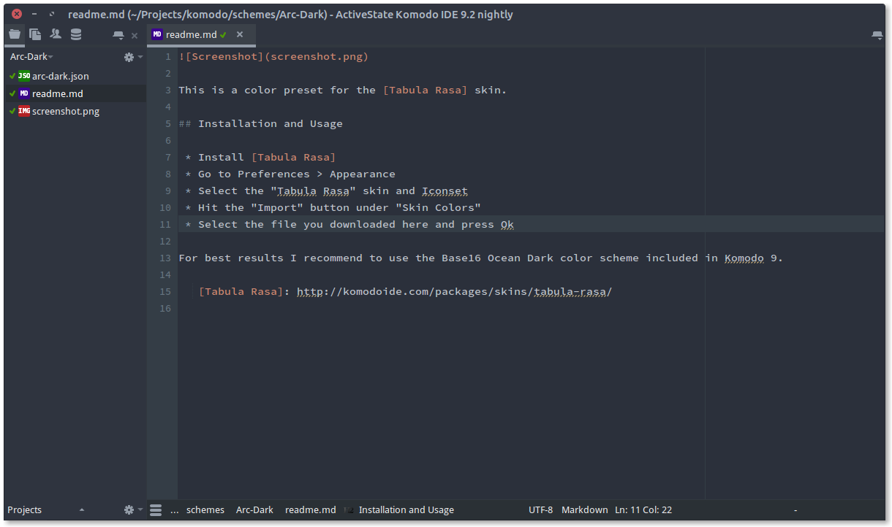

This is a color preset for the [Tabula Rasa] skin.

## Installation and Usage

 * Install [Tabula Rasa]
 * Go to Preferences > Appearance
 * Select the "Tabula Rasa" skin and Iconset
 * Hit the "Import" button under "Skin Colors"
 * Select the file you downloaded here and press Ok

For best results I recommend to use the Base16 Ocean Dark color scheme included in Komodo 9.

   [Tabula Rasa]: http://komodoide.com/packages/skins/tabula-rasa/
